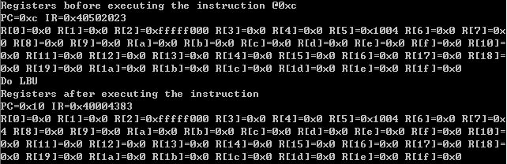
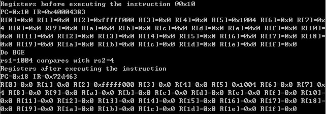
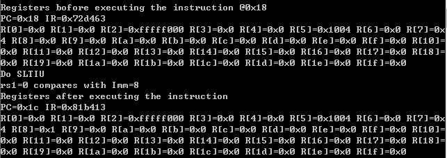
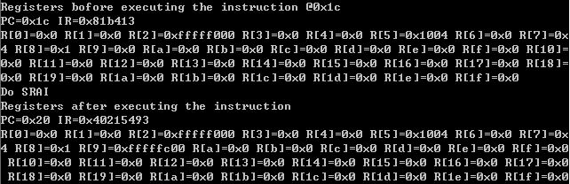

# 实验报告

通信1502班 201508030211 王旸

## 实验目标

设计一个CPU模拟器，能模拟CPU指令集的功能。

## 实验要求

* 采用C/C++编写程序
* 模拟器的输入是二进制的机器指令文件
* 模拟器的输出是CPU各个寄存器的状态和相关的存储器单元状态

## 实验内容

### CPU指令集

CPU的指令集请见[这里](http://some.web.page)，其中共有_n_条指令。

所需写入的指令为LUI,BGE,LBU,SLTIU,SRAI.

### 模拟器程序框架

考虑到CPU执行指令的流程为：

1. 取指
2. 译码
3. 执行（包括运算和结果写回）

对模拟器程序的框架设计如下：

```C++
while(1) {
    inst = fetch(cpu.pc);
    cpu.pc = cpu.pc + 4;
    
    inst.decode();
    
    switch(inst.opcode) {
        case ADD:
            cpu.regs[inst.rd] = cpu.regs[rs] + cpu.regs[rt];
            break;
        case /*其它操作码*/ :
            /* 执行相关操作 */
            break;
        default:
            cout << "无法识别的操作码：” << inst.opcode;
    }
}
```

其中while循环条件可以根据需要改为模拟终止条件。

### 具体指令编码内容如下

```C++
case LUI:
	cout << "Do LUI" << endl;
	cout<<"Imm="<<Imm31_12UtypeZeroFilled<<endl;
	R[rd] = Imm31_12UtypeZeroFilled;
	break;
	
case BRANCH:
	switch(funct3) {
		case BGE:
			cout << "Do BGE" << endl;
			cout<<"rs1="<<(int)src1<<" compares with rs2="<<(int)src2<<endl;
			if((int)src1 >= (int)src2)
				NextPC = PC + Imm12_1BtypeSignExtended;
			break;
		default:
			cout << "ERROR: Unknown funct3 in BRANCH instruction " << IR << endl;
	}
	break;

case LOAD:
	switch(funct3) {
		case LBU:
			cout << "Do LBU" << endl;
			R[rd] = readByte(Imm11_0ItypeSignExtended + src1) & 0x000000ff;
			break;
		default:
			cout << "ERROR: Unknown funct3 in LOAD instruction " << IR << endl;
	}
	break;
	
case ALUIMM:
	switch(funct3) {
		case SLTIU:
			cout << "Do SLTIU" << endl;
			cout<<"rs1="<<src1<<" compares with Imm="<<(unsigned int)Imm11_0ItypeSignExtended<<endl;
			if(src1<(unsigned int)Imm11_0ItypeSignExtended)
				R[rd] = 1;
			else
				R[rd] = 0;
			break;
			case SHR:
			switch(funct7) {
				case SRAI:
					cout << "Do SRAI" << endl;
					R[rd] = ((int)src1) >> shamt;
					break;
				default:
					cout << "ERROR: Unknown (imm11_0i >> 5) in ALUIMM SHR instruction " << IR << endl;
			}
			break;
		default:
			cout << "ERROR: Unknown funct3 in ALUIMM instruction " << IR << endl;
	}
	break;
```

## 测试

### 测试平台

模拟器在如下机器上进行了测试：

| 部件     | 配置             | 备注   |
| :--------|:----------------:| :-----:|
| CPU      | core i5-6500U    |        |
| 内存     | DDR3 4GB         |        |
| 操作系统 | Windows 7        | 中文版 |

### 测试记录

模拟器的测试输入如下所示。

```C++
void progMem() {
	writeWord(0, (0xfffff << 12) | (2 << 7) | (LUI));
	writeWord(4, (1 << 12) | (5 << 7) | (AUIPC));
	writeWord(8, (0x20<<25) | (5<<20) | (0<<15) | (SW << 12) | (0 << 7) | (STORE));
	writeWord(12, (0x400<<20) | (0<<15) | (LBU<<12) | (7<<7) | (LOAD));
	writeWord(16, (0x0<<25) | (7<<20) | (5<<15) | (BGE<<12) | (0x8<<7) | (BRANCH));
	writeWord(24, (0x8<<20) | (3<<15) | (SLTIU<<12) | (8<<7) | (ALUIMM));
	writeWord(28, (SRAI<<25) | (0x2<<20) | (0x2<<15) | (SHR<<12) | (9<<7) | (ALUIMM));
}
```
指令作用分别为

LUI创建32位无符号整数，存放立即数到rd的高20位，低12位置0。上述指令中立即数为fffff，存入R[2]，存入的数为fffff000

LBU从存储器加载一个8位值，然后在存储到rd之前将零扩展到32位。上述指令中从地址400+0出取出数据1004并取04再零扩展后存入R[7]中

BGE当R[rs1] >= R[rs2]时, 进行跳转。上述指令中取R[5]=1004与R[7]=4进行比较，并进行跳转至PC+8处。

SLTIU如果rs小于立即数(都是无符号整数),将rd置1,否则置0。上述指令中取R[3]=与立即数进行比较，并将结果放入R[8]中。

SRAI算数右移，符号移入高位。上述指令中，将R[2]中的值右移2位并存入R[9]中


模拟器运行过程的截图如下：

LUI指令运行后模拟器的输出


LBU指令运行后模拟器的输出



BGE指令运行后模拟器的输出



SLTIU指令运行后模拟器的输出



SRAI指令运行后模拟器的输出




## 分析和结论

从测试记录来看，模拟器实现了对二进制指令文件的读入，指令功能的模拟，CPU和存储器状态的输出。

根据分析结果，可以认为编写的模拟器实现了所要求的功能，完成了实验目标。

