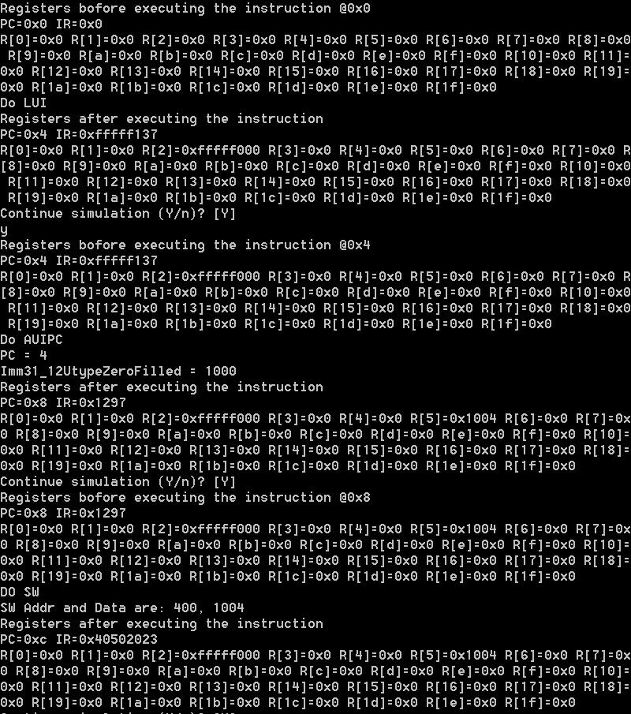
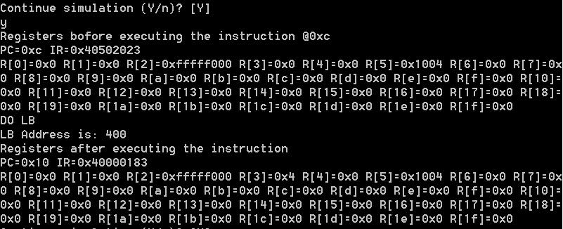
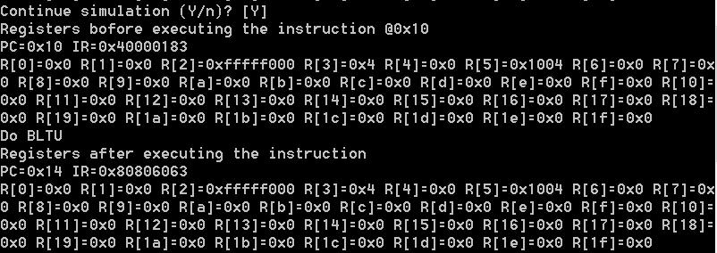
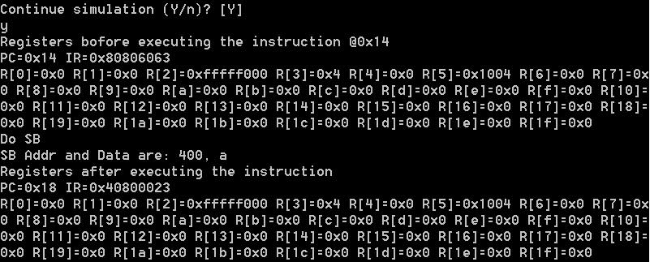
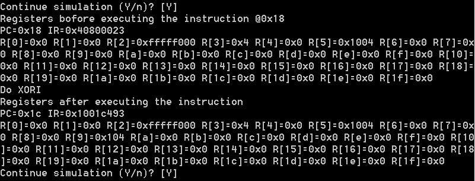
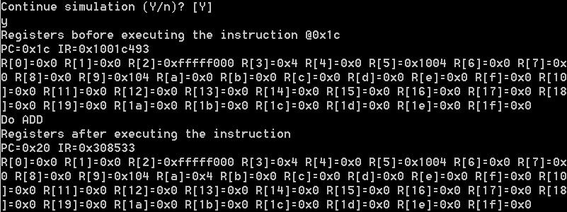
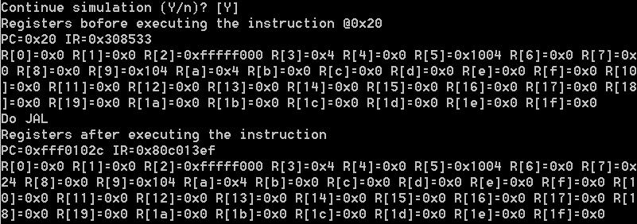

# 实验报告
## 实验名称（RISC-V基本指令集模拟器设计与实现）

班级：通信1502班

学号：201508030226

姓名：李雨亭

## 实验目标

设计一个CPU模拟器，能模拟CPU指令集的功能。

## 实验要求 

* 采用C/C++编写程序
* 模拟器的输入是二进制的机器指令文件
* 模拟器的输出是CPU各个寄存器的状态和相关的存储器单元状态

## 实验内容

### CPU指令集

CPU的指令集请见[这里](https://riscv.org/specifications/)，其中基本指令集共有_47_条指令。其中的五条指令为我完成的指令,分别为：JAL、BLTU、SB、XORI、ADD

### 模拟器程序框架

考虑到CPU执行指令的流程为：

1. 取指
2. 译码
3. 执行（包括运算和结果写回）

对模拟器程序的框架设计如下：

```C++
while(1) {
    inst = fetch(cpu.pc);
    cpu.pc = cpu.pc + 4;
    
    inst.decode();
    
    switch(inst.opcode) {
        case ADD:
            cpu.regs[inst.rd] = cpu.regs[rs] + cpu.regs[rt];
            break;
        case /*其它操作码*/ :
            /* 执行相关操作 */
            break;
        default:
            cout << "无法识别的操作码：” << inst.opcode;
    }
}
```

其中while循环条件可以根据需要改为模拟终止条件。

### 具体指令内容如下

```C++
switch(opcode) {
			case JAL:
				cout << "Do JAL" << endl;
				R[rd]=PC+4;
				NextPC = PC+ Imm20_1JtypeSignExtended;    
				break;
			case BRANCH:
				switch(funct3) {
					case BLTU:
						cout << "Do BLTU" << endl;
						if(src1<src2){
							NextPC=PC+Imm12_1BtypeSignExtended;
						}
						break;
					default:
						cout << "ERROR: Unknown funct3 in BRANCH instruction " << IR << endl;
				}
				break;
			case STORE:
				switch(funct3) {
					case SB:
						cout << "Do SB" << endl;
						char sb_d1;
						unsigned int sb_a1;
						sb_d1=R[rs2] & 0xff;
						sb_a1 = R[rs1] +Imm11_0StypeSignExtended;
						cout << "SB Addr and Data are: " << sb_a1 << ", " << sb_d1 << endl;
						writeByte(sb_a1, sb_d1);
						break;
					default:
						cout << "ERROR: Unknown funct3 in STORE instruction " << IR << endl;
				}
				break;			
			case ALUIMM:
				switch(funct3) {
					case XORI:
						cout << "Do XORI" << endl;
						R[rd]=(Imm11_0ItypeSignExtended)^R[rs1];
						break;
					default:
						cout << "ERROR: Unknown funct3 in ALUIMM instruction " << IR << endl;
				}
				break;
			case ALURRR:
				switch(funct3) {
					case ADDSUB:
						switch(funct7) {
							case ADD:
								cout << "Do ADD" << endl;
								R[rd]=R[rs1]+R[rs2];
								break;
							default:
								cout << "ERROR: Unknown funct7 in ALURRR ADDSUB instruction " << IR << endl;
						}
						break;
					default:
						cout << "ERROR: Unknown funct3 in ALURRR instruction " << IR << endl;
				}
				break;
	default:
				cout << "ERROR: Unkown instruction " << IR << endl;
				break;
		}

```

## 测试

### 测试平台

模拟器在如下机器上进行了测试：

| 部件     | 配置             | 备注   |
| :--------|:----------------:| :-----:|
| CPU      | core i5-6500U    |        |
| 内存     | DDR3 4GB         |        |
| 操作系统 | Windows 8 | 中文版 |

### 测试记录

模拟器的测试输入指令：
```C++
void progMem() {
	writeWord(0, (0xfffff << 12) | (2 << 7) | (LUI));
	writeWord(4, (1 << 12) | (5 << 7) | (AUIPC));
	writeWord(8, (0x20<<25) | (5<<20) | (0<<15) | (SW << 12) | (0 << 7) | (STORE));
	writeWord(12, (0x400<<20) | (0<<15) | (LB<<12) | (3<<7) | (LOAD));
	writeWord(16, (1<<31) |(0<<25) | (8<<20) | (0<<15) | (BLTU << 12) | (0 << 11) |(0 << 7) | (BRANCH));
	writeWord(20, (0x20<<25) | (8<<20) | (0<<15) | (SB << 12) | (0 << 7) | (STORE));
	writeWord(24, (0x100<<20) | (3<<15) | (XORI << 12) | (9 << 7) | (ALUIMM));
	writeWord(28, (ADD<<25) | (3<<20) | (1<<15) | (ADDSUB << 12) | (10 << 7) | (ALURRR));
	writeWord(32, (1 << 31) |(1 << 23) |(1 << 22) |(1 << 12) | (7 << 7) | (JAL));
}
```

JAL、BLTU、SB、XORI、ADD指令的作用：
* JAL：直接跳转指令，并带有链接功能，指令的跳转地址在指令中，跳转发生时要把返回地址存放在R[rd]寄存器中。
* BLTU：为无符号比较，当R[rs1] < R[rs2]时,进行跳转。
* SB：SB指令取寄存器R[rs2]的低位存储8位值到存储器。有效的字节地址是通过将寄存器R[rs1]添加到符号扩展的12位偏移来获得的。
* XORI:在寄存器R[rs1]上执行位XOR的逻辑操作，并立即将符号扩展12位，将结果放在R[rd]中。注意：XORI R[rd]，R[rs1]，-1执行寄存器R[rs1]的位逻辑反转。
* ADD:进行加法运算，R[rs1]+R[rs2]，将结果存入R[rd]中。

**模拟器运行过程的截图如下：**


进行5条指令之前由执行过其他指令后的地址和各个寄存器的值






BLTU指令运行后模拟器的输出



测试指令分别取R[0]为R[rs1]和R[8]为R[rs2]进行比较，因为两者皆为0，所以跳转条件不成立，则PC=PC+4=0x14。测试结果正确。

SB指令运行后模拟器的输出



测试指令分别取R[0]为R[rs1]和R[8]为R[rs2],地址为R[rs1] +Imm11_0StypeSignExtended，根据测试指令，Imm11_0StypeSignExtended=400，而R[0]=0,所以Addr=400，DATA=a,测试结果正确。

XORI指令运行后模拟器的输出



测试指令取R[9]为R[rd],原值为0，取R[3]为R[rs1],原值为0x4,为Imm11_0ItypeSignExtended赋值为0x100,与R[rs1]进行XOR,结果为0x104存入R[9]中，测试结果正确。

ADD指令运行后模拟器的输出



测试指令分别取R[1]为R[rs1]和R[3]为R[rs2]相加，原值分别为0x0和0x4,结果为0x4存入R[a]中，测试结果正确。

JAL指令运行后模拟器的输出




## 分析和结论

从测试记录来看，模拟器实现了对十六进制指令文件的读入，指令功能的模拟，CPU和存储器状态的输出。

根据分析结果，可以认为编写的模拟器实现了所要求的功能，完成了实验目标。

