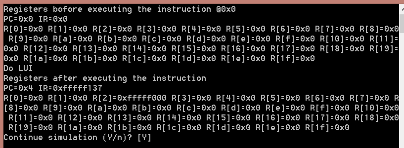
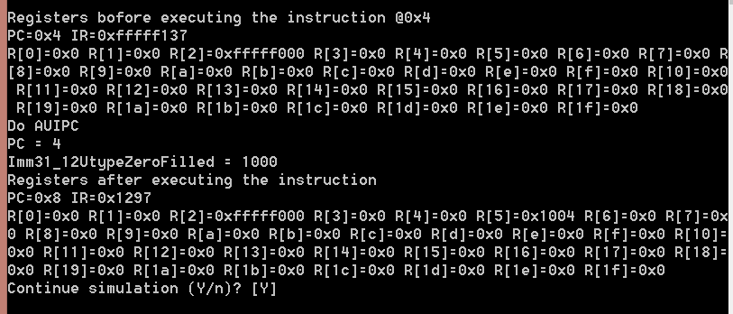
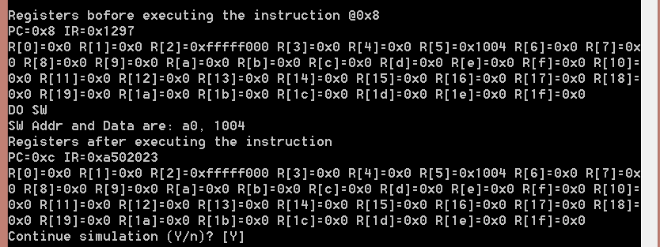
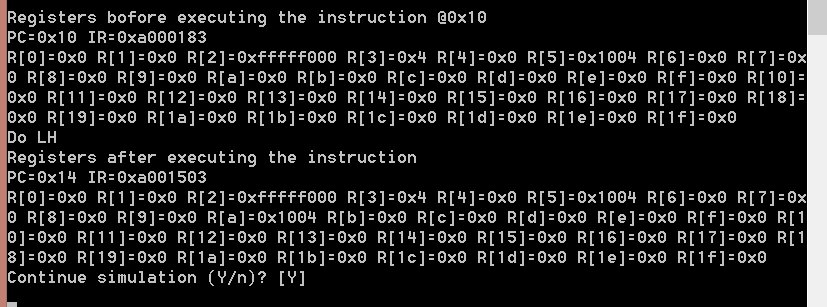
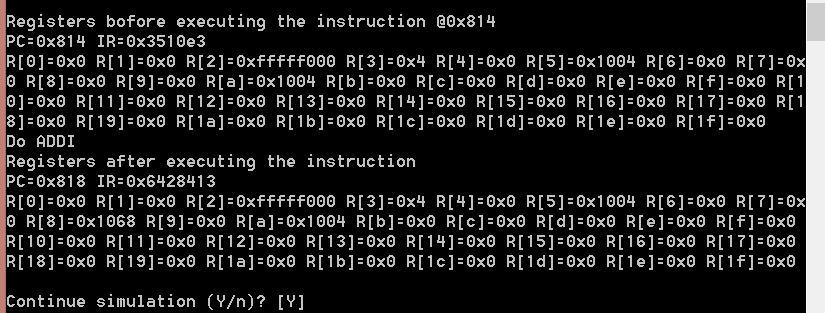
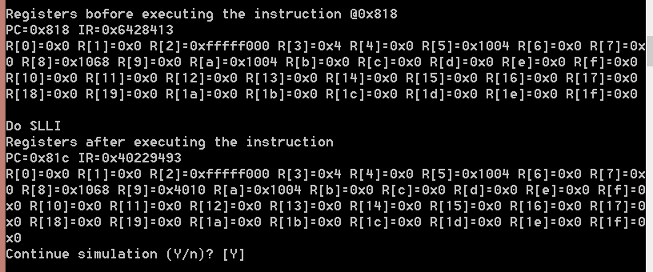
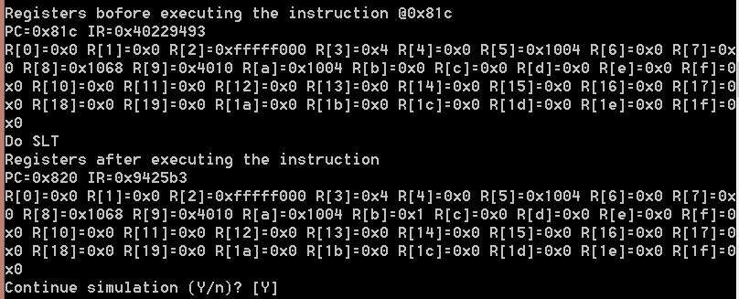

# 实验报告

## 实验名称（RISC-V基本指令集模拟器设计与实现）

班级：数媒1501 学号：201526010219 姓名：曹昕奕

## 实验目标

设计一个CPU模拟器，能模拟CPU指令集的功能。

## 实验要求

* 采用C/C++编写程序
* 模拟器的输入是二进制的机器指令文件
* 模拟器的输出是CPU各个寄存器的状态和相关的存储器单元状态

## 实验内容

### CPU指令集

CPU的指令集请见[这里](https://riscv.org/specifications/)，其中基本指令集共有_47_条指令。

### 模拟器程序框架

考虑到CPU执行指令的流程为：

1. 取指
2. 译码
3. 执行（包括运算和结果写回）

对模拟器程序的框架设计如下：

```C++
while(1) {
    inst = fetch(cpu.pc);
    cpu.pc = cpu.pc + 4;
    
    inst.decode();
    
    switch(inst.opcode) {
        case LUI:
				cout << "Do LUI" << endl;
				R[rd] = Imm31_12UtypeZeroFilled;
				break;
		case AUIPC:
				cout << "Do AUIPC" << endl;
				cout << "PC = " << PC << endl;
				cout << "Imm31_12UtypeZeroFilled = " << Imm31_12UtypeZeroFilled << endl;
				R[rd] = PC + Imm31_12UtypeZeroFilled;
				break;
        case BRANCH:
                switch(funct3) {
					case BNE:
						cout << "Do BNE " << endl;
						if(src1!=src2){
							NextPC = PC + Imm12_1BtypeSignExtended;
						}
						break;
					default:
						cout << "ERROR: Unknown funct3 in BRANCH instruction " << IR << endl;
				}
				break;
         case LOAD:
				switch(funct3) {
					case LH:
						cout << "Do LH " << endl;
						unsigned int temp_LH,temp_LH_UP;
						temp_LH=readHalfWord(src1+Imm11_0ItypeSignExtended);
						temp_LH_UP=temp_LH>>15;
						if(temp_LH_UP==1){
							temp_LH=0xffff0000 | temp_LH;
						}else{
							temp_LH=0x0000ffff & temp_LH;
						}
						R[rd]=temp_LH; 
						break;
					default:
						cout << "ERROR: Unknown funct3 in LOAD instruction " << IR << endl;
				}
				break;
        case ALUIMM:
				switch(funct3) {
					case ADDI:
						cout <<    "Do ADDI" << endl;
						R[rd]=src1+Imm11_0ItypeSignExtended;
						break;
					case SLLI:
						cout << "Do SLLI " << endl;
						R[rd]=src1<<shamt;
						break；
					default:
						cout << "ERROR: Unknown funct3 in ALUIMM instruction " << IR << endl;
				}
				break;
        case ALURRR:
				switch(funct3) {
					case SLT:
						cout << "Do SLT " << endl;
						if((int)src1<(int)src2){
							R[rd]=1;
						}else{
							R[rd]=0;
						}
						break;
					default:
						cout << "ERROR: Unknown funct3 in ALURRR instruction " << IR << endl;
				}
				break;
        default:
            cout << "无法识别的操作码：” << inst.opcode;
    }
}
```

其中while循环条件可以根据需要改为模拟终止条件。

除此之外，为了验证程序的可行性，在模拟器程序里面添加了测试程序,详情如下：
```C++
void progMem() {
	// Write starts with PC at 0
	writeWord(0, (0xfffff << 12) | (2 << 7) | (LUI));
	writeWord(4, (1 << 12) | (5 << 7) | (AUIPC));
	writeWord(8, (0x05<<25) | (5<<20) | (0<<15) | (SW << 12) | (0 << 7) | (STORE));
	writeWord(12, (0xa0<<20) | (0<<15) | (LB<<12) | (3<<7) | (LOAD));
	writeWord(16, (0xa0<<20) | (0<<15) | (LH<<12) | (10<<7) | (LOAD));
	writeWord(20, (0x0<<31) | (0x0<<25) | (3<<20) | (10<<15) | (BNE<<12) | (0x0<<8) | (1<<7) | (BRANCH));
	writeWord(0x814, (0x64<<20) | (5<<15) | (ADDI<<12) | (8<<7) | (ALUIMM));
	writeWord(0x818, (0x402<<20) | (5<<15) | (SLLI<<12) | (9<<7) | (ALUIMM));
	writeWord(0x81c, (0<<25) | (9<<20) | (8<<15) | (SLT<<12) | (11<<7) | (ALURRR));
}
```
指令解释：
其中指令LUI是将Utype类型零扩展立即数放入rd寄存器中；指令AUIPC是将Utype类型立即数零扩展后加上当前的PC地址放入rd寄存器中；指令SW是将rs1寄存器中的数据加上Stype类型符号扩展立即数作为地址，将rs2寄存器中的数据作为32位的data写入；指令LB是将rs1中的数据加上Itype类型符号扩展立即数作为地址读一个字节，再将其符号扩展后存入rd寄存器中；指令LH是将rs1中的数据加上Itype类型符号扩展立即数作为地址读半个字，再将其符号扩展后存入rd寄存器中；指令BNE是比较rs1和rs2寄存器中数据是否相等，如果不相等，则跳转到当前PC地址加上Btype类型符号扩展立即数；指令ADDI是将rs1寄存器中的数据加上Itype类型符号扩展立即数存入rd寄存器中；指令SLLI是将Itype类型符号扩展立即数的低5位的数值当做rs1逻辑左移的偏移量存入rd寄存器中；指令SLT是有符号比较rs1和rs2寄存器中数值大小，如果rs1中的数值小于rs2的，则rd寄存器存储1，否则为0。

## 测试

### 测试平台

模拟器在如下机器上进行了测试：

| 部件     | 配置             | 备注   |
| :--------|:----------------:| :-----:|
| CPU      | core i5-6500U    |        |
| 内存     | DDR3 4GB         |        |
| 操作系统 | Ubuntu 18.04 LTS | 中文版 |

### 测试记录

模拟器的测试输入文件请见[这里](./test.input)。

模拟器运行过程的截图如下：

第一条指令LUI运行后模拟器的输出



第二条指令AUIPC运行后模拟器的输出



第三条指令SW运行后模拟器的输出



第四条指令LB运行后模拟器的输出


第五条指令LH运行后模拟器的输出



第六条指令BNE运行后模拟器的输出


第七条指令ADDI运行后模拟器的输出



第八条指令SLLI运行后模拟器的输出



最后一条指令SLT运行后模拟器的输出



## 分析和结论

从测试记录来看，模拟器实现了对二进制指令的读入，指令功能的模拟，CPU和存储器状态的输出。

根据分析结果，可以认为编写的模拟器实现了所要求的功能，完成了实验目标。

