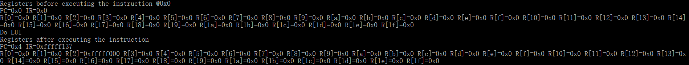
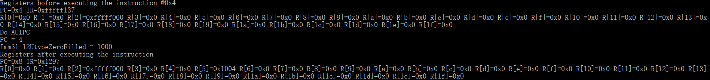
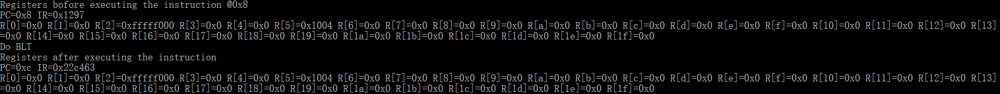
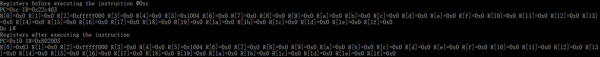
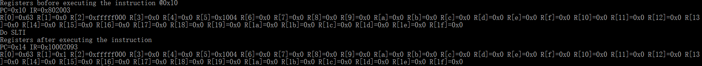
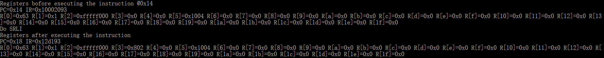
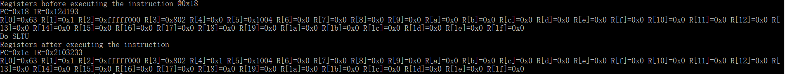

# 实验报告

## RISC-V基本指令集模拟器设计与实现

数媒1501班 201526010309 刘子睿

## 实验目标

设计一个CPU模拟器，能模拟CPU指令集的功能。

## 实验要求

* 采用C/C++编写程序
* 模拟器的输入是二进制的机器指令文件
* 模拟器的输出是CPU各个寄存器的状态和相关的存储器单元状态

## 实验内容

### CPU指令集

所需写入的指令为BLT,LW,SLTI,SRLI,SLTU.

### 模拟器程序框架

考虑到CPU执行指令的流程为：

1. 取址
2. 译码
3. 执行（包括运算和结果写回）

对模拟器程序的框架设计如下：

```C++
while(1) {
    inst = fetch(cpu.pc);
    cpu.pc = cpu.pc + 4;
    
    inst.decode();
    
    switch(inst.opcode) {
        case ADD:
            cpu.regs[inst.rd] = cpu.regs[rs] + cpu.regs[rt];
            break;
        case /*其它操作码*/ :
            /* 执行相关操作 */
            break;
        default:
            cout << "无法识别的操作码：” << inst.opcode;
    }
}
```

其中while循环条件可以根据需要改为模拟终止条件。

### 具体指令编码内容如下

```C++
case BRANCH:
	switch(funct3) {
		case BLT:
			cout << "Do BLT" << endl;
			if((int)src1<(int)src2){
				NextPC = PC + Imm12_1BtypeSignExtended;
			}
			break;
		default:
			cout << "ERROR: Unknown funct3 in BRANCH instruction " << IR << endl;
	}
	break;

case LOAD:
	switch(funct3) {
		case LW:
			cout << "Do LW" << endl;
			unsigned int temp_LW,temp_LW_UP;
			temp_LW=readByte(src1+Imm11_0ItypeSignExtended);
			temp_LW_UP=temp_LW>>31;
			if(temp_LW_UP==1){
				temp_LW=0x00000000 | temp_LW;
			}else{
				temp_LW=0xffffffff & temp_LW;
			}
			R[rd]=temp_LW;
			break;
		default:
			cout << "ERROR: Unknown funct3 in LOAD instruction " << IR << endl;
	}
	break;
	
case ALUIMM:
	switch(funct3) {
		case SLTI:
			cout << "Do SLTI" << endl;
			if(src1<Imm11_0ItypeSignExtended)
				R[rd] = 1;
			else
				R[rd] = 0;
			break;
			case SHR:
			switch(funct7) {
				case SRLI:
					cout << "Do SRLI" << endl;
					R[rd]=src1>>shamt;
					break;
				default:
					cout << "ERROR: Unknown (imm11_0i >> 5) in ALUIMM SHR instruction " << IR << endl;
			}
			break;
		default:
			cout << "ERROR: Unknown funct3 in ALUIMM instruction " << IR << endl;
	}
	break;
case ALURRR:
	switch(funct3) {
		case SLTU:
			cout << "Do SLTU" << endl;
			if(src2!=0){
				R[rd]=1;
			}else{
				R[rd]=0;
			}
			break;
		default:
			cout << "ERROR: Unknown funct3 in ALURRR instruction " << IR << endl;
	}
	break;
```

## 测试

### 测试平台

模拟器在如下机器上进行了测试：

| 部件     | 配置             | 备注   |
| :--------|:----------------:| :-----:|
| CPU      | core i5-6500U    |        |
| 内存     | DDR3 4GB         |        |
| 操作系统 | Windows 10        | 中文版 |

### 测试记录

模拟器的测试输入如下所示。

```C++
void progMem() {
	writeWord(0, (0xfffff << 12) | (2 << 7) | (LUI));
	writeWord(4, (1 << 12) | (5 << 7) | (AUIPC));
	writeWord(8, (0x0<<25) | (2<<20) | (5<<15) | (BLT<<12) | (0x8<<7) | (BRANCH));
	writeWord(12, (0x8<<20) | (0<<15) | (LW<<12) | (0x0<<7) | (LOAD));
	writeWord(16, (0x100<<20) | (0<<15) | (SLTI<<12) | (0x1<<7) | (ALUIMM));
	writeWord(20, (SRLI<<25) | (0x1<<20) | (0x5<<15) | (SHR<<12) | (0x3<<7) | (ALUIMM));
	writeWord(24, (0x1<<25) | (0x1<<20) | (0<<15) | (SLTU<<12) | (0x4<<7) | (ALURRR));
}
```
指令作用分别为

LUI创建32位无符号整数，存放立即数到rd的高20位，低12位置0。上述指令中立即数为fffff，存入R[2]，存入的数为fffff000

BLT当R[rs1] < R[rs2]时, 进行跳转。上述指令中取R[5]与R[2]进行比较，并进行跳转至PC+8处。

LW从内存中取32位的值存入rd。上述指令中取rd=0。

SLTI如果rs1小于立即数(有符号整数),将rd置1,否则置0。上述指令中取R[0]与立即数进行比较，并将结果放入R[1]中。

SRLI算数右移。上述指令中，将R[5]中的值右移1位并存入R[3]中。

SLTU如果R[rs2]不等于0，将rd置1，否则置0。上述指令中取R[1]进行比较，结果存入R[4]。


模拟器运行过程的截图如下：

LUI指令运行后模拟器的输出



AUIPC指令运行后模拟器的输出



BLT指令运行后模拟器的输出



LW指令运行后模拟器的输出



SLTI指令运行后模拟器的输出



SRLI指令运行后模拟器的输出



SLTU指令运行后模拟器的输出




## 分析和结论

从测试记录来看，模拟器实现了对二进制指令的读入，指令功能的模拟，CPU和存储器状态的输出。

根据分析结果，可以认为编写的模拟器实现了所要求的功能，完成了实验目标。

