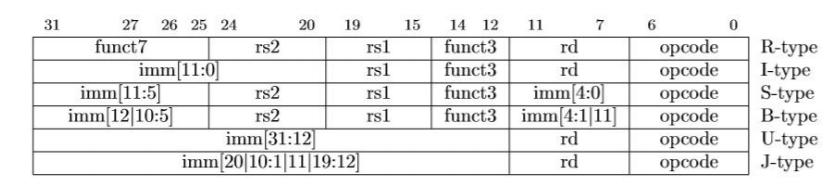
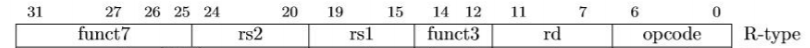
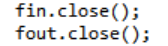

# 实验报告

## 实验名称（RISC-V基本指令集汇编器设计与实现）

班级：智能1602 学号：201608010627 姓名：任小禹

## 实验目标

设计一个CPU汇编器，能将汇编语言的CPU指令集输出为二进制机器指令。

## 实验要求

* 采用C/C++编写程序
* 模拟器的输入是汇编语言代码文件
* 模拟器的输出是二进制机器码文件

## 实验内容

### CPU指令集

CPU的指令集请见[这里](https://riscv.org/specifications/)，其中基本指令集共有47条指令。
除去系统指令我们这里实现37条。
各指令格式，共6类指令



### 程序框架
```C++
void decode(){
//首先是将各类指令的操作码用数组opcode存起来
}
void getnum(string s){
//获取各个操作数，将其用数组存起来
}
void solveX(int op, int rd, int rs1, int rs2){ // X-type 
    fout<< bitset<32>(op |(rd<<X)|(rs2<<X)|(rs1<<X)) <<endl;//各类型的指令输出为二进制机器码文件
}
int main(){
	while(fin>>op>>s){//文件读入操作码和操作数
		if(op=""){
			getnum();//获取操作数
			solveX();//输出为二进制机器码
		}
	}
}
```
### 设计思路
汇编器的重点其实就是各类指令的格式，将各类指令的格式理解清楚，输出二进制机器码就不是很难，在这里要注意的完全没有必要将JALR和I类指令的load类指令单独列出来，I类指令的格式是统一的，可以一起处理。
以R类型指令为例：
void solveR(int op, int rd, int rs1, int rs2){ // R-type 
    fout<< bitset<32>(op |(rd<<7)|(rs2<<20)|(rs1<<15)) <<endl;
}


我们可以看得rd寄存器是在7~11位，所以左移7位，rs2寄存器是在20~24位，rs1寄存器是在15~19位，所以分别左移20位和15位。

另外要注意C++文件输入和输出流的写法，输入流ifstream，输出流ofstream

## 测试

### 测试平台

模拟器在如下机器上进行了测试：

| 部件     | 配置             | 备注   |
| :--------|:----------------:| :-----:|
| CPU      | core i7-8750U    |        |
| 内存     | DDR3 8GB         |        |
| 操作系统 | windows 10 | 中文版 |


### 测试记录
详细见data.txt文件和output.txt文件
这里举1个指令的例子
输入ADD r3,r1,r2
00000000001000001000000110110011
指令操作码是0x33，在0~6位，最后7位0110011，与0x33相等。
rd寄存器是在7~11位，为11B，即为3。
rs2寄存器是在20~24位，rs1寄存器是在15~19位，分别为10B和1B，即为2和1，与输入相符。
## 遇到的问题
文件输入流和文件输出流最后一定要有关闭函数将其关闭，不然可能会有错误的答案。

## 分析和结论

从测试记录来看，汇编器实现了对汇编指令的读入，指令功能的模拟，二进制机器指令的输出。

根据分析结果，可以认为编写的汇编器实现了所要求的功能，完成了实验目标。
## 收获与体会

汇编器编写的重点就是对各类型指令格式的掌握，理清楚指令的格式，一切就迎刃而解，剩下的就是一些编程技能的问题，包括C++如何进行文件输入和输出。
在这里要注意的是I类指令最复杂，包含算术和逻辑指令，装载指令和条件转移指令，但其实编写汇编器的时候没必要将它们分开，因为其指令格式相同。编写完汇编器感觉对RISC-V基本指令集掌握的更好了，硬件部分也要加油了。
