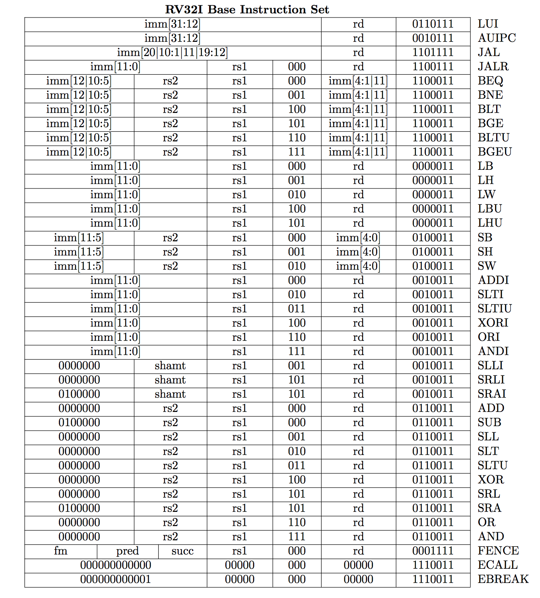

# <center>Circuits实验报告</center>

## 实验名称（RISC-V的基本整数指令集RV32I的CPU设计）

- 学号：201508010321
- 姓名：李艺永

## 实验目标

完成一个执行RISC-V的基本整数指令集RV32I的CPU设计（单周期实现）。

## 实验内容

RV32I的基本整数指令集如下：



以上指令中，`FENCE`, `ECALL`和`EBREAK`未实现，其他指令都有相应的实现。实现的源代码在`circuits/source`目录下，主要组建如下：

- `alu.vhdl`: ALU对应单元的实现
- `mem.vhdl`: RAM及其控制器
- `opcodes.vhdl`: 包含了不同编码的opcodes
- `registerfile.vhdl`: 32个通用目的寄存器
- `pc.vhdl`: PC的实现
- `control_unit.vhdl`: 用于指令解码、解释和发出对应控制信号
- `core.vhdl`: CPU的组成

总体的电路图如下：

### ALU的设计
显而易见地，base integer RV32I ISA所支持的算数或逻辑运算都是二元运算，操作数的形式可能是register-register或register-immediate，分别对应R型编码的指令和I型编码的指令。这两种编码的指令运算的逻辑是相同的。由此我在设计ALU时，决定ALU无需区分操作数的来源，并且操作数的值由control_unit通过指令解码直接提供给ALU。ALU的接口如下：

```vhdl
entity alu is
    port(
        i_data1 : in std_logic_vector(31 downto 0); -- Data in rs1
        i_data2 : in std_logic_vector(31 downto 0); -- Data in rs2 or immediate.
        i_op : in alu_op_t;                         -- Operation to perform.
        q_res : out std_logic_vector(31 downto 0);  -- Result of the operation.
        q_br : out boolean                          -- A flag that indicates whether the conditional branch will be taken. Used in ir_decoder.
    );
end alu;
```

ALU的architecture部分是通过一个case语句对不同operations进行对应的操作：

```vhdl
case i_op is
    when ALU_ADD => -- Both ADDI and ADD
        q_res <= std_logic_vector(signed(i_data1) + signed(i_data2));
    ...
```

### Mem的设计

由于我事前考虑的欠缺，内存组件被设计未CPU的一部分。内存组件主要用于读取指令，同时Load和Store类指令也会操作内存。该组件的接口如下：

```vhdl
entity mem is
    port(
        -- Input.
        clk : in std_logic;                             -- Controls write.
        -- For Load.
        i_addr : in std_logic_vector(31 downto 0);      -- Address to access.
        i_ld_sz : in std_logic_vector(1 downto 0);      -- The size to load: BYTE_SZ, HALFW_SZ, or WRD_SZ.
        i_sign_ex : in boolean;                         -- True for reading sign-extended value, false for reading unsigned.

        -- For Store.
        i_data : in std_logic_vector(31 downto 0);      -- Input data to store in [i_addr].
        i_st_sz : in std_logic_vector(1 downto 0);      -- The size to store. Same as [i_ld_sz].
        en_write : in boolean;                          -- Write gate.

        -- Output.
        q_data : out std_logic_vector(31 downto 0);     -- The 4-byte data output.
        q_ir : out std_logic_vector(31 downto 0)        -- The instruction to load.
    );
end entity;
```

`i_addr`作为访问的地址，无论是读取指令还是Load/Store操作所需的地址都是从该接口传入。为了支持不同的Load类指令，
`i_ld_sz`用于传入Load的大小，`i_sign_ex`表示Load的结果是否需要符号位扩展。
`q_data`是Load类指令读出的数据，`q_ir`是读出的指令。
Store写入内存必须在时钟上升沿阶段才能有效。类似的，registerfile的写操作也是如此。

### PC的设计

接口如下：
```vhdl
entity pc is
    port(
        i_clk : in std_logic;
        i_reset : in std_logic;
        i_mode : in std_logic_vector(1 downto 0);       -- See below the arch body.
        i_pc_off : in std_logic_vector(31 downto 0);    -- The offset to add.
        i_abs_addr : in std_logic_vector(31 downto 0);  -- The absolute address wired directly from ALU.

        q_val : out std_logic_vector(31 downto 0);      -- The val of pc register.
        q_val_next : out std_logic_vector(31 downto 0)  -- The next val of pc register in NORMAL mode. Used in branches.
    );
end pc;
```

PC寄存器在普通模式下顺序执行指令，每个周期内PC的值会增加4字节，每条指令在一个周期内完成。
为了支持条件分支（conditional branch）和无条件分支，`i_mode`用于传递这个信息；`i_pc_off`为PC所需增加的offset；`i_abs_addr`为绝对地址。

`q_val`是当前PC的值，`q_val_next`是下一条指令的地址。

### Registerfile的设计

该设计比较简单，此处不展开描述。

### Control_unit的设计

Control_unit是该CPU的核心，输出的控制信号用于操控以上的部件。概括地说，control_unit进行指令解码、指令解释和分发任务到相应组件的操作。

该组件接口比较混乱，代码量较多，但是源码内有比较充足的注释，总体的蓝图并不难懂。

## 测试

运行的平台和工具可参考README。以下是一些对应testbench的示例：

## 总结

由于我之前对硬件设计没有什么研究，对数字电路兴趣较少，所以此次实验耗时较长。在此期间，我恶补了一些之前混着过的内容，因为我想把这个设计做好。